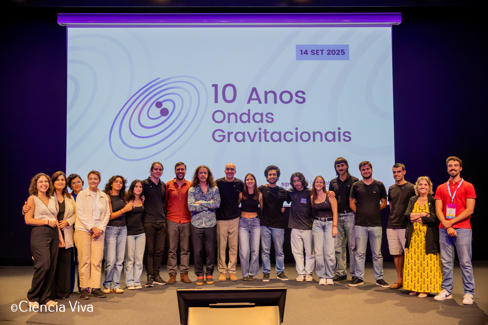

# Outreach

Doing research comes with the responsibility to make our findings avaliable to the general population. After all, we do research to push the boundaries of human knowledge. If we keep that knowledge to ourselves we risc not having any funding!

## 10 Years of Gravitational Waves

On the 14th of September 2015, the LIGO collaboration detected the first gravitaional wave. 10 years after on the 14th of Septeber 2025, we celebrated this event with a big national wide event in Portugal.

<figure style="display: flex; flex-direction: column; align-items: center; width: 100%; margin: auto;">
  
</figure>