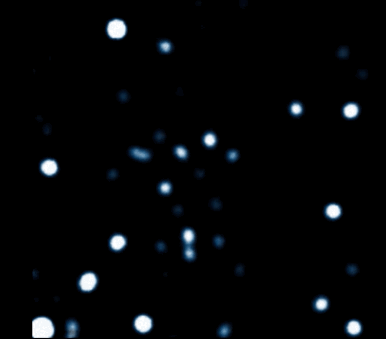

Black holes are some of the weirdest objects in the universe. Not because they are complicated but because they are extremely simple. When we look at the complexity of the world around us, it is weird that such objects seem to exist in the universe. If you would take planet Earth and compress it to the size of a peanut you would form a black hole. It would look something like this

<figure class='research_image'>
  
</figure>

It looks nothing like the Earth! In fact, if someone handed you this peanut-sized black hole, you would have no way of telling it had been formed from compressing a planet. You would just know it has the same mass as the planet Earth. This property of Black Holes is so weird that it has been immortalized in with the phrase "black holes have no hair". Indeed, if you ever tried to find me in a crowd of bald people, you will know how hard it is -- all black holes look the same. This sentence was imortalized in what is now called the no-hair conjecture:

 
Any Black Hole can be uniquely described by its  
Mass, Electric Charge, and Spin

This conjecture is one of the biggest unanswered questions in our understanding of the theory of gravity that Einstein proposed more than 100 years ago. Underlying my research is trying to answer this question by combining our theoretical understanding of gravity with the most precise observations of the most massive object in our galaxy - Sagittarius A*.

<figure class='research_image'>
  
</figure>

## A Fantastic Beast

Since the early 1970s we knew there was something massive lurking at the center of our galaxy. When we would point our Radio telescopes at the hearth of the Milky way, we would see gas moving at very high velocities within a very small region. This set the ground for what is almost half a century of exploring of the central region of our galaxy. Nowadays, we observe the Galactic Center using Near Infrared Radiation. This part of the electromagnectic can penetrate the thick dust regions prevent us from direcly observe the Galactic Center using optical radiation. Over the past 30 years we have been able to track the motion of a dozens of stars that move around a central dark point. 

<figure class='research_image'>
  
</figure>

